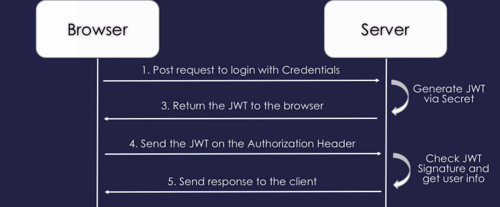

## Signing vs Encrypting

The only differece between asymmetric **signing** and **encrypting** is that; *signing* data is done with the private key, while *encrypting* data is done with the public key. 

Signing
* uses the ***private key*** to sign (*encrypt*)
* usually readable by everyone since the public key is used to decrypt, and the public key is.. public

Encrypting
* uses the ***public key*** to encrypt
* only readable by whoever has the private key to decrypt

Just a reminder on `encoding` and `decoding` before getting into it:  
`"hello" | urlencode == "hello"`  
`"hello" | base64encode == "aGVsbG8="`  
`"hello" | base64urlencode == "aGVsbG8="	// same as base64, except '+' '/' '=' is replaced with '-' '_' '%'`  
`"hello" | urlencode == "68656c6c6f"`  

## JWT (RFC 7519)

A good resource [jwt.io](https://jwt.io)

JSON Web Tokens allow you to digitally sign information (claims) with a signature that can be verified at a later time with a secret signing key (HMAC), or a public/private key pair (RSA/ECDSA). 
* Securely transfer information between any two entities. 
* Self-contained
	* Contains information about the user (*can be encrypted, optional*)
	* This information saves us a database query (*after the user is logged in*)
	

JWT is used for
* **Authentication**
* **Information exchange**



Three distinct parts of a JWT that is URL encoded
* **Header** - metadata for the token and at a minimal contains the type of the signature and/or encryption algorithm
* **Claims** - contains any information that you want signed (* authentication token*)
* **JSON Web Signature (JWS)** - the headers and claims digitally signed using the algorithm in the specified header  
The most important thing is, they are ***signed***. This ensures *the claims have not been tampered with* when stored and passed between your service or another service - *verifying the signature*. 

`aaaa.bbbb.cccc` where `aaaa` is the header `base64Url` encoded, `bbbb` is the claims `base64Url` encoded, and `cccc` is the HMAC of `aaaa` + `bbbb` + `secret` in `base64Url` encoded format. If you change `aaaa` or `bbbb`, naturally  when you HMAC(`aaaa`,`bbbb`,`secret`) it won't match `cccc`. Therefore you cannot tamper with the data without invalidating it.

This entire structure, `aaaa.bbbb.cccc`, is what we refer to as the ***JWT***. 

* Client Request
```
//header (base64urlencoded)
{
    "alg": "HS256", //denotes the algorithm (shorthand alg) used for the  signature is HMAC SHA-256
    "typ": "JWT" //denotes the type (shorthand typ) of token this is
}
 
//claims (base64urlencoded)
{
    "sub": "tom@stormpath.com",
    "name": "Tom Abbott",
    "role": "user"
}
//hmacsha256
hmac // HMAC(base64UrlEncode(header) + "." + base64UrlEncoded(payload), secret)
```
* Server side
```
// no database queries needed
HMAC(request.header + "." + request.payload, secret) == request.hmac
```


#### Alternative, JWT in code
```
var headers = base64URLencode(myHeaders);
var claims = base64URLencode(myClaims);
var payload = header + "." + claims;
 
var signature = base64URLencode(HMACSHA256(payload, secret));
 
var encodedJWT = payload + "." + signature;
```

* If signature algorithm is set to `none` and it should be signed, it should fail verification immediately. 
* Do not contains any sensitive data in JWT. Data in claims can easily be decoded and read. 
* If you are worried about replay attacks, include *nonce* (`jti` claim), *expiration time* (`exp` claim) and *creation time* (`iat` claim) in the claims. 

### JWT vs JWS vs JWE
* JWT - unsigned token (plaintext)
* JWS - signed token 

## Session token

## Attribute/Authorization and public key certificates

Attribute certificate
* is issued by an **attribute authority (AA)** (controls a service, or resource)
* is used to characterize or entitle its holder like a ***visa***
* attribute information frequently changes (short validity time)
* separate certificates with different security rigours, validity times and issuers are necessary
* can be chained to delegate attributions
	* Alice is authorized to use a particular service
	* Alice delegates this privilege to Bob by issuing an AC for Bob's PKC
	* Bob presents his PKC and a chain of ACs:
		* Starting with Bob's AC
		* to Alice's AC issued by the issuer that the service trusts
	* The service can now verify that
		* Alice has delegated her privilege to Bob
		* Alice has been authorized to use the service by the issuer that controls the service

Public key certificate
* is issued by a **certificate authority (CA)**
* is used as proof of identity of its holder like a **passport**
* identity information seldom changes (long validity time)
* can be chained to delegate attributions


An AC **verifier** is under the control of the AC *issuer*, and therefore, trusts the issuer directly by having the public key of the issuer preinstalled. The verification of an AC requires the presence of the PKC that is referred as the AC holder in the AC.  
To use a service or a resource ***that the issuer of an AC controls***, a user presents both the PKC **and** the AC to a part of the the service or resource that functions as an *AC verifier*. The following happens in order:
* The verifier checks the identify of the user using the PKC (encrypts a message with the public key and expects the user to decrypt it with the private key)
* The verifier uses the preinstalled public key of the AC issuer to check the validity of the presented AC
* The verifier will check whether or not the PKC specified in the AC matches the presented PKC.
* The verifier will check the validity period of the AC 
* The verifier can still perform additional checks before offering the user a particular level of service or resource usage.
