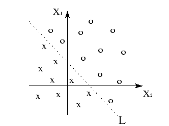

# Machine Learning notes

## Sections
- [Introduction to Machine Learning](#intro)
- [Applying Machine Learning to an End-to-End project](#end-to-end-machine-learning)
- [Classification](#classification)
- [Training Models](#training-models)
- [Decision Trees](#decision-trees)
- [Ensemble Learning and Random Forests](#ensemble-learning-and-random-forests)
- [Dimensionality Reduction](#dimensionality-reduction)
- [Terms](#terms)

# Intro

**What is Machine Learning?**  
**Machine Learning** are algorithms whose performance improve as they are exposed to more data over time. Machine Learning is based on the idea that we can build machines (with algorithms) to process data and learn on their own, without our constant supervision. It is a branch of Artificial Intelligence.
> *A computer program is said to learn from experience E with respect to some task T and some performance measure P, if its performance on T, as measured by P, improves with experience E.*  

**Artificial Intelligence** is the simulation of human intellgience processes by machines:

- *learning* - the acquisition of information and rules for using the information 
- *reasoning* - using rules to reach approximate or definite conclusions 
- *self-correction*  

**Deep Learning** is a subset of Machine Learning in which multilayered neural networks learn from vast amounts of data.  

**Where can we use it?**  
Complicated problems with no well-defined solutions, and with too much, or complicated, data. Where programs need to be flexible and adapt to their inputs.  

**How?**  
Instead of defining the rules to use on the data to get the correct answers, we put a lot of data combined with answers into algorithms to let the system come up with the rules. The data contain a lot of characteristics, or *features*, that the algorithms use to see similarities and distinguish the different data points.  

Machine Learning needs a robust infrastructure and good pipelines to be effective. IMG  

**Why?**  

- Instead of writing a lot of extremely complex rules, a machine learning model can figure out good predictors and rules on its own. 
- A shorter program, that is easier to maintain, and more accurate. 
- Fluctuating environments. A regular program require a programmer to update the rules as the input changes. A machine learning model can adapt to new input. 
- Complex problems where there is no good solution using a traditional approach.
- Data mining. Getting insights about complex problems and large amounts of data.  

---

**Types of machine learning**

- **Supervised learning** - The models are trained using labeled training data. They are used to make predictions on unseen or future data. The goal is to learn connections between input and desired output. Function approximation. This is where 99% of machine learning resides. E.g. how likely is a customer to repay this potential loan?  
- **Semisupervised learning**  - A small portion of the data is labeled. Label one person in Google Photo and their clustering algorithm detect that person in the rest of your photos. 
- **Unsupervised learning** - Find meaningful patterns in data, without feedback. Involves clustering and anomaly detection. E.g. grouping customers based on their purchasing history.
    - **Anomaly detection** is an unsupervised task to detect outliers or unusual behaviour (prevent fraud, manufacturing defects), or automatically removing outliers from a dataset before feeding it to another learning algorithm. A system trained on normal instances can detect anomalies. 
    - **Association rule learning** digs into large amounts of data and discovers interesting relations between attributes. People who buy this also buy this.
- **Reinforcement learning** - An agent gathers information from its environment and learns to select actions that maximize a reward. A *policy* defines what action the agent should choose when it is in a given situation. E.g. AlphaGo  
- **Online learning** - Learn incrementally on the fly (*mini-batches*). Adapts rapidly and autonomously, uses less resources, and can discard old data. Bad data degrade the system's performance; monitor closely.
    - **out-of-core learning** is when the algorithm loads the data in parts (too big for memory).
    - **Learning rate** is how fast the model learns on new data. High learning rate results in rapid adaption towards new data, but quickly forgets old data. Low learning rate results in the model learning more slowly, but less susceptible to noise or nonrepresentative data points. 
- **Offline learning** - Batch learning. First the system is trained on all the data, and then it is launched into production and runs without learning anymore. New data means retrain on all the old + new data. Time consuming, requires lots of computing resources, big datasets use a lot of space.
- **Instance-based learning** - Compare new data points to known data points. Uses a measure of similarities between a new data point and old data points. The system learns the examples by heart, then generalizes to new cases using a similarity measure.
- **Model-based learning** - Detect patterns in the data and build predictive models. A linear regression model is a straight line that can be tweaked to best fit through all the data points in a graph. As the algorithm trains on the data it tweaks the function parameter such that the line of the model is as close to the data points as possible and can make fairly good predictions.
    - **Cost function** is a function the algorithm uses to measure how far off the model is from the labeled data points. The algorithm chooses the model with the parameters that produce the smallest cost, or distance from the correct data points.
    - **Utility function** is the oppsite of the cost function. It measures how good the model is.

**Classification** is the process of classifying data points into a class or group (categorized). Dog or cat?  
**Regression** is a technique used to model and analyze the relationships between variables (*predictors* or *features*) and how they contribute to produce a specific *target* value. Predicting the price of a car based on mileage, year, etc.

Visualization of the data is an essential part of machine learning. Carefully designed plots can reveal patterns in the data which one later can use to when constructing predictive machine learning models.  

**Training data** - the data used to train the model. The model will be bad at *generalization* if the model is trained on all the data. Each training example, or row, is called a *training instance*.  
**Test data** - a subset of the training data used to measure the accuracy of the predictions made by the model. Test data is used to evaluate the model.  
**Attribute** = data type (e.g., "Mileage")
**Feature** = data type + value (e.g., "Mileage = 1000 miles")  
**Feature engineering** is the process of figuring out a good set of features to train on. It is one of the most important parts of machine learning. Most of the time and code is spent collecting data, cleaning data and designing good features:

- **Feature selection** is the process of selecting the most useful features to train on among *existing* features.
- **Feature extraction** is the process of using existing features and build derived values (features) intended to be informative and non-redundant.  
- Creating new features by gathering new data.

**Accuracy** is the performance measure of the model with respect to the task and what the model is trying to predict.  
**Data mining** is discovering patterns in large amounts of data.  
**Inference** is applying the model to make prediction on new cases.  

**Machine learning algorithms:**
    
- **Regression**
	- Linear Regression - estimate real values based on continuous variables.
	- k-Nearest Neighbors - the data point is assigned the class that is most common amongst its K nearest neighbors measured by distance (Euclidean, Manhattan, Hamming)
	- XGBoost - gradient boosting algorithm with high predictive power. Almost 10x faster than existing gradient booster techniques. 
- **Classification**
	- Logistic Regression - estimate discrete values based on independent variables.
	- Decision Tree - splits the data into as distinct groups as possible based on multiple attributes.
	- Support Vector Machine - plots each data point in n-dimensional space (n == #features) where the value of each feature is the coordinate for the data point. It figures out the best line to split the classified groups of data. 
	- k-Nearest Neighbors - the data point is assigned the class that is most common amongst its K nearest neighbors measured by distance (Euclidean, Manhattan, Hamming)
	- XGBoost - gradient boosting algorithm with high predictive power. Almost 10x faster than existing gradient booster techniques. 
	- Random Forest - collection of decision trees. The forest picks the class picked by the most trees. 
- **Clustering**
    - K-means - picks k number of points for each cluster (centroids). Each data point forms a cluster with the closest centroids. The algorithm recalculates the centroid (sum of square of difference between centroid and data points) for each cluster based on new member data points. 
    - Hierarchical Cluster Analysis - may subdivide each group into smaller groups.
    - Expectation Maximization
- **Visualization and dimensionality reduction**
    - Visualization algorithms - inputs a lot of complex and unlabeled data, and outputs a 2D or 3D easily plottable representation of the data. 
    - Dimensionality Reduction algorithms - reduce the number of features by removing less important attributes, or merge multiple attributes (*feature extraction*). Simplify the data without losing too much information. 
    - Principal Component Analysis (PCA)
    - Kernel PCA
    - Locally-Linear Embedding (LLE)
    - t-distributed Stochastic Neighbor Embedding (t-SNE)
- **Associative rule learning**
    - Apriori
    - Eclat

---
## Main Challenges of Machine Learning

### Bad Data

Machine learning algorithms need **a lot** of data, and with insufficient quantities of data your result will not be good. It's not uncommon to hear that data matters more than algorithms.

### Nonrepresentative Training Data

The data must be representative of the new cases you want to generalize to. Maybe you are missing a lot of data for certain groups, or you have a lot of data which doesn't represent new cases very well. In case of the linear regression model, the solid line making the model would adjust accordingly to the extra training data making it more representative and generalize better. It is crucial to use a training set that is representative of the cases you want to.

- *Sampling noise* - the training sample is too small (i.e., nonrepresentative data as a result of chance).
- *Sampling bias* - the training sample is nonrepresentative if the sampling method is flawed. The training sample is a *biased* sample when some members of the intended population have a lower sampling probability than others. A non-random sample of a population (or non-human factors) in which all individuals, or instances, were not equally likely to have been selected. 
	- *Non response bias* - when there is a significant difference between those who responded to your survey and those who did not (didn't bother, bad surveys, forgot, etc.)

### Poor-Quality Data

It will be hard for the system to detect underlying patterns in the data if the data is full of errors, outliers, and noise (e.g., poor quality measurements).

- It may help to completely discard errors, or "fix" them manually.
- If some instances are missing features, you gotta either ignore this attribute altogether, ignore these instances, fill in the missing value (e.g., median value), or train one model with the feature and one model without it.

### Irrelevant Features

Garbage in, garbage out. The system needs good relevant features to train on. 

### Overfitting the Training Data

- *Overfitting* means that the model performs well on the training data, but it does not generalize well. The model is too complex relative to the amount and noisiness of the training data. With sampling noise the model can detect patterns in the noise itself which will not generalize well to new instances. A model trying to determine the life expectency of people, and which figures out that people with the letter "n" in their name contribute to higher life expectency, has clearly been misleed by sampling noise. The data may by chance show this pattern, but this model clearly won't generalize well to new instances. 
	- Simplify the model to one with fewer parameters (e.g. high-degree polynomial model to a linear model), reduce the number of attributes in the training data, or constrain the model (*regularization*).
		- *Regularization* of a linear model that has two *degrees of freedom* (parameters) would involve constraining it down to only being able to change one of them (one degree of freedom), or maybe force it to keep one of the parameters small (e.g., the slope of the line cannot be above 0.5). A simpler model that is less prone to errors and outliers (*sampling noise*).
		- *Hyper parameter* is a parameter of a *learning algorithm* (not of the model) used to apply regularization. It must be set prior to training, and remains constant during training.
	- Gather more training data.
	- Reduce noise in the training data (e.g., fix errors and remove outliers)

### Underfitting the Training Data

Underfitting occurs when the model is too simple to learn the underlying structure of the data (e.g., linear model).

- Select a more powerful model, with more paramters.
- Feed better features to the learning algorithm (feature engineering)
- Reducing the constraints on the model (e.g., reducing the regularization hyperparameter)

---

## Testing and Validating

Testing the model on a test set gives an estimation of the *generalization error*; the error rate on new cases. It tells you how well the model performed on cases it has never seen before. 

- *Overfitting:* Training error is low, but the generalization error is **high**.

When picking a model you want to train a lot of them with different hyperparameter values to pick the ultimate best model. If you do this on the test set it will again overfit the test set. Use a separate ***validation set*** for this, and use the test set for a final estimate of the generalization error.

- *Cross-validation* splits the training set into complementary subsets, and each model is trained against a different combination of these subsets and validated against the remaining parts. The best model is selected, and this time trained on the *full* training set, and lastly evaluated against the test set.

# End-to-End Machine Learning

# Classification

# Training Models

# Decision Trees

# Ensemble Learning and Random Forests

### Terms

***Linear separability*** refers to the fact that classes of patterns with *n*-dimensional vector x = (x_1, x_2, ... , x_n) can be separated with a single decision surface.  

