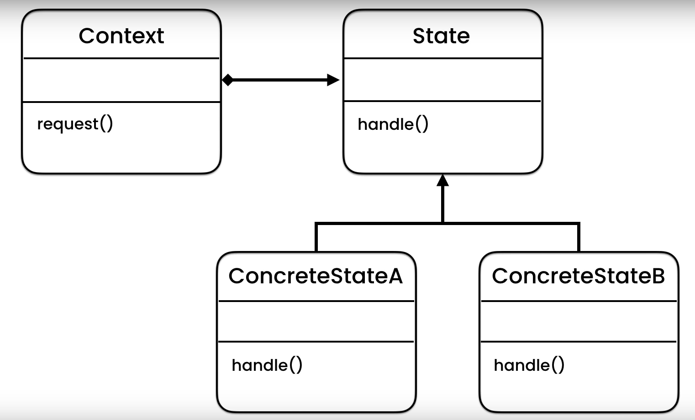
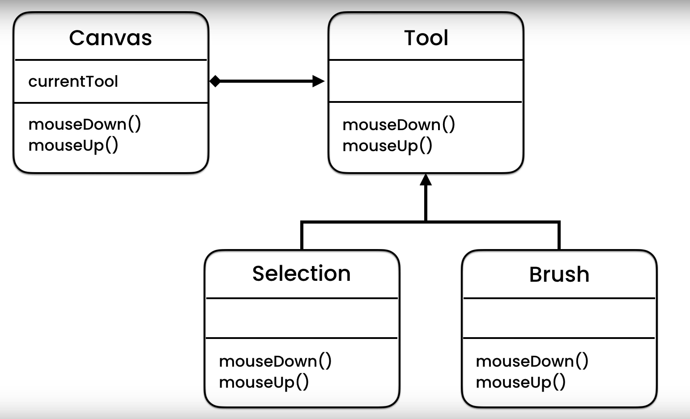

### Low coupling 
Imagine a car where you can just change the tire if its punctured, that's low coupling

## Interface 
A restaurant isn't dependent on a particular chef but that it has a chef (`interface`)

## Ecapsulation
Without the `private` keyword anyone can change a member variable and skip input validation (e.g. setting `bob.age = -2`)

## Abstraction
Hide implementation detail, make most methods private if possible

## Inheritance
Reuse already written code 

## Polymorphism
An object can take on many forms 
```
static void drawShape(Shape shape) {
	shape.draw()	
}
drawShape(new Circle());
drawShape(new Rectangle());
```


## Memento
------
The memento pattern is used to implemented undo mechanisms.

Memento pattern  
  
A text editor with an undo mechanism implemented using Memento pattern  
  

## State
------
The state pattern is a behavioral design pattern that allows an object to alter its behavior when its internal **state** changes (using *polymorphism*). This allows us to follow the *Open Closed Principle*: our classes and modules should be *open for extension* but *closed for modification*.
  
State pattern
  
Implementation  



## MVC (Model View Controller)
------

Controller 
- Handles request flow
- Never handles data logic
- Tells the model what to do / what data to get
- Interacts with Model and View (Model and View never interact directly with each other)

Model
- Handles data logic
- Interacts with database
- Handles validation, CRUD
- Doesn't have to worry about client requests

View
- Presents data from controller
- Dynamically rendered
- The rendered data is sent back to controller in a HTML


Client 			---- Get Cats -----------> 	Controller
Controller	---- Get Cats Data ------> 	Model
Controller 	<--- Cats Data -----------	Model
Controller	---- Get Presentation --->	View
Controller 	<--- Cats Presentation ---	View
Client 			<--- <ul> Cats </ul> -----	Controller

If an error occurs, the controller will request an error view from View
